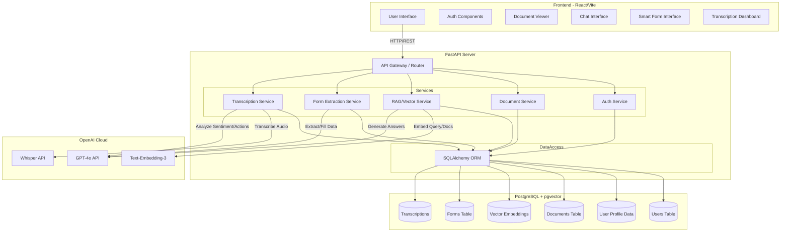
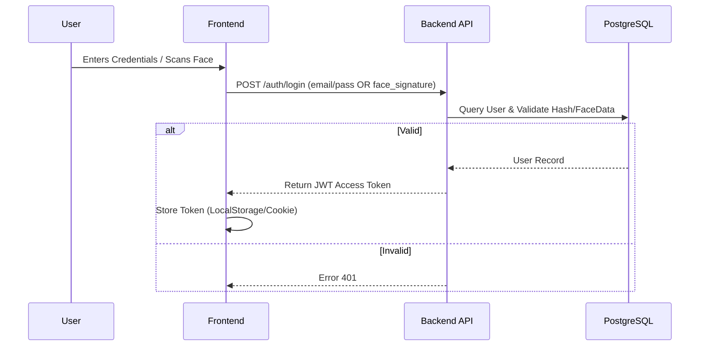
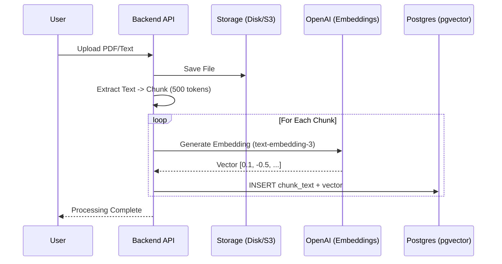
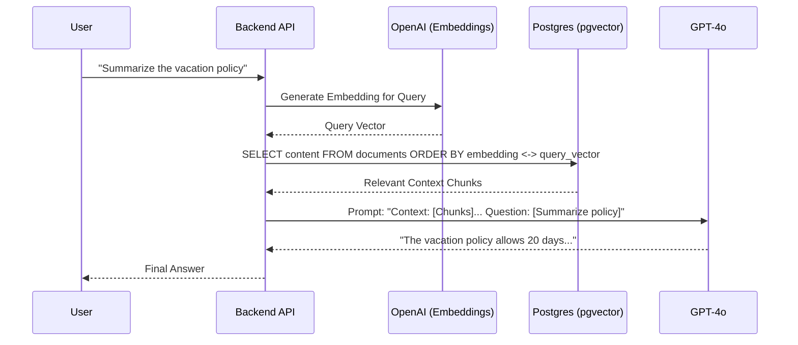
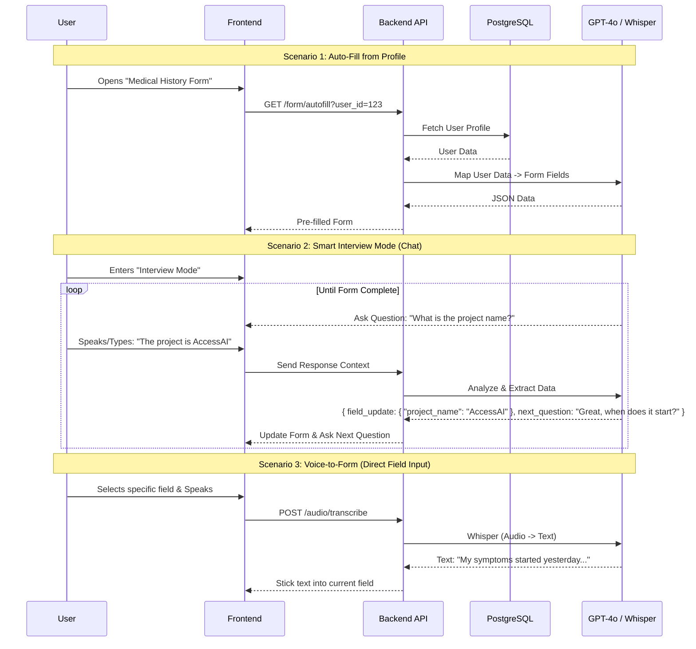
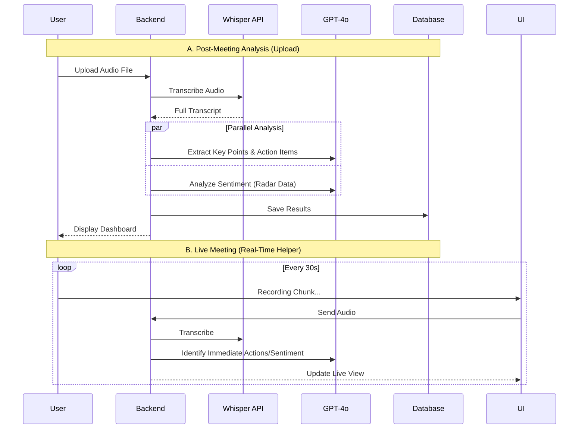

# System Architecture & Data Flow

This document outlines the high-level architecture and detailed data flows for the AI-Native Application.

## 1. High-Level Architecture

## 2. Authentication Flow (Biometric & Standard)

## 3. Document Ingestion Pipeline (The "Brain")
*How we turn a PDF into searchable AI memory.*

## 4. Semantic Search & RAG (Chat)
*Finding answers using the "Brain".*

## 5. Smart Form System (Auto-Fill & Voice)

## 6. Advanced Transcription (Live & Upload)

