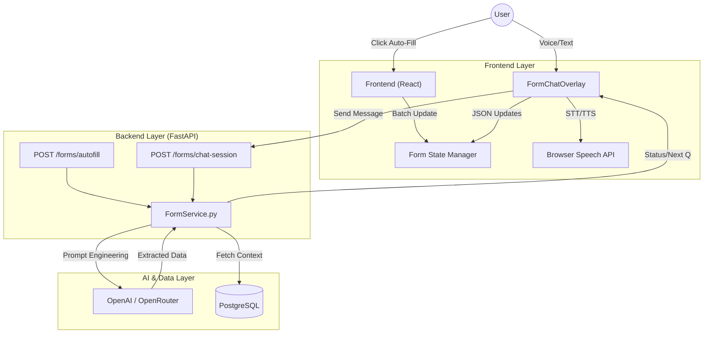

# ACCESS.AI - Forms Module & Smart Interview Agent Architecture

## 1. Overview
The **Forms Module** is a core component of the ACCESS.AI platform, designed to eliminate the friction of manual data entry for users with disabilities. It leverages **Generative AI** and **Voice Interaction** to transform static forms into dynamic, conversational experiences.

This document details the technical implementation of:
1.  **Context-Aware Auto-Fill**: Intelligently pre-populating forms based on user profile and history.
2.  **Smart Interview Agent**: A conversational bot that "interviews" the user to gather missing information, featuring full Voice-to-Text (STT) and Text-to-Speech (TTS) capabilities.

---

## 2. Architecture Diagram



---

## 3. Feature In-Depth: AI Auto-Fill

### 3.1. Workflow
When a user selects a form (e.g., "Leave Application"), the **Auto-Fill** engine triggers to minimize effort immediately.

1.  **Context Retrieval**: The backend fetches the `User` profile (Name, Email, Employee ID, Disability Type) from PostgreSQL.
2.  **Dynamic Prompting**: A prompt is constructed containing:
    *   **User Context**: "User is a Senior Engineer, based in NY..."
    *   **Form Schema**: A simplified JSON definition of fields (Label, Type, ID).
    *   **Instruction**: "Map known user data to these fields. If a field like 'Department' can be inferred, do so."
3.  **LLM Execution**: The prompt is sent to `gpt-3.5-turbo` (or `gpt-4`). The model returns a JSON object of `{ field_id: value }`.
4.  **Heuristic Fallback**: To guarantee reliability, a "Heuristic Overlay" runs *after* the AI. Crucial fields like `full_name` and `email` are hard-coded from the database user record, ensuring 100% accuracy even if the AI hallucinates or fails.
5.  **Frontend Update**: The React page receives the JSON and performs a batch update of the form state.

---

## 4. Feature In-Depth: Smart Interview Agent

The **Smart Interview Agent** is a stateful, interactive overlay that allows users to complete clear, complex forms using natural language.

### 4.1. Frontend: Voice & Interaction (`FormChatOverlay.tsx`)
*   **Voice Engine**: We utilized a custom React hook `useSpeechRecognition` that wraps the native **Web Speech API**.
    *   **Singleton Pattern**: The hook ensures only one recognition instance exists to prevent "mic fighting" or race conditions.
    *   **Echo Cancellation**: When the AI starts speaking (TTS), the microphone automatically pauses to prevent the system from listening to itself.
*   **Text-to-Speech (TTS)**: The AI's responses are read aloud using `speechSynthesis`. We implemented a robust queuing system (using `useRef`) to prevent garbage collection bugs common in Chrome, ensuring long sentences are spoken completely.
*   **Optimistic UI**: Chat messages appear instantly for the user, while the "Thinking..." state handles the network latency.

### 4.2. Backend: Logic Core (`form_service.py`)
The conversational logic is stateless but context-aware, handled by the `interactive_chat` method.

**The "Loop":**
1.  **Input Analysis**: The LLM receives the **User's Message** and the **Current Form Schema**.
2.  **Entity Extraction**: It extracts any data mentioned (e.g., "I need leave from Monday to Friday" -> `start_date`, `end_date`).
3.  **State Check**: The system iterates through the form fields to find the **next missing 'required' field**.
4.  **Response Generation**:
    *   If fields are missing: It generates a targeted, natural language question (e.g., "What is the reason for your leave?").
    *   If complete: It issues a completion signal, instructing the user to review and submit.
5.  **Output**: Returns a JSON structure containing:
    ```json
    {
       "extracted_updates": { "reason": "Medical appointment" },
       "next_question": "Who is your emergency contact?"
    }
    ```

### 4.4. Data Synchronization: Chat-to-Form
A critical challenge was ensuring the chat overlay updates the main form in real-time without refreshing the page. We implemented a **Live-Sync Architecture**:

1.  **AI Extraction**: The backend model is trained (via system prompt) to return a dedicated `extracted_updates` JSON key. It maps the user's natural language input (e.g., "My manager is John Doe") to the precise form field ID (e.g., `manager_name`).
2.  **Frontend Consumption**:
    *   The `FormChatOverlay` component receives this JSON response.
    *   It triggers the `onUpdateFields` prop, which is mapped to the parent `batchUpdateFields` function in `FormsPage.tsx`.
3.  **State Reactivity**:
    *   `batchUpdateFields` uses React's `setFormData` with a functional update pattern `prev => ({ ...prev, ...updates })`.
    *   This instantly reflects the value in the background form fields *while* the chat is still open, providing immediate visual confirmation to the user that their data was captured.

### 4.3. Error Handling & Token Optimization
*   **OpenRouter Integration**: The backend automatically detects `sk-or-` keys and routes traffic to the OpenRouter API gateway.
*   **Token Budgeting**: To prevent timeouts and budget overruns on limited accounts, we enforce strict `max_tokens` limits (500 tokens) on responses, forcing the AI to be concise and efficient.
*   **Robustness**: If the AI API fails (e.g., 401/402 errors), the backend catches the exception and returns it as a "Chat Message" so the user is informed rather than the UI crashing.

---

## 5. Technology Stack
*   **Frontend**: React (Vite), TailwindCSS, Shadcn/UI, Lucide React (Icons).
*   **Backend**: Python FastAPI, SQLAlchemy, PostgreSQL.
*   **AI**: OpenAI API / OpenRouter (GPT-3.5-Turbo).

---

## 6. Accessibility & Inclusive Design (WCAG 2.1)
The module was built with a "Zero-Friction" philosophy for users with disabilities:

*   **Motor Impairment**: Complete **Voice-First** control. Users can navigate, fill, and submit forms without a single mouse click or keystroke.
*   **Visual Impairment**: 
    *   **Screen Reader Optimization**: All chat elements are semantically tagged.
    *   **Audio Hints**: The "AI Speaking" and "Listening" states provide audible cues.
    *   **High Contrast**: The interface uses `shadcn/ui` primitives with high-contrast text and focus rings.

## 7. Configuration & Deployment

To replicate this setup, the following Environment Variables are required in `.env`:

```bash
# Critical for AI Services
OPENAI_API_KEY=sk-or-xxxx  # Supports OpenAI or OpenRouter
OPENAI_BASE_URL=https://openrouter.ai/api/v1 # Optional override

# Model Selection (Cost Optimization)
LLM_MODEL=openai/gpt-3.5-turbo # Defaults to gpt-3.5-turbo for speed/cost
```

## 8. Future Roadmap
*   **Multi-Language Support**: Real-time translation of forms into user's native language.
*   **Offline Mode**: Local STT models (e.g., Whisper Tiny) for privacy-first operations.
*   **Document Parsing**: Ability for the AI to "read" an uploaded PDF and auto-fill the form from it.
