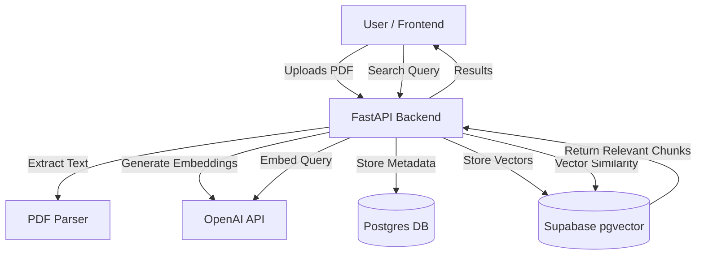

# 🧠 RAG & Semantic Search: Behind the Scenes

This guide explains exactly how the **Document RAG (Retrieval-Augmented Generation)** and **Semantic Search** modules work in your application. It covers the journey of data from the moment a user interacts with the Frontend, through the Backend, to the Database, and finally to the AI.

---

## 🏗️ High-Level Architecture

The system relies on a **Vector Database** approach. Unlike normal databases that search for exact text matches (like Ctrl+F), this system "understands" the *meaning* of text by converting it into numbers (Vectors).



---

## 🚀 Flow 1: Document Ingestion (Upload & RAG Setup)

This is what happens when you upload a file in `DocumentsPage.tsx`.

### **Step 1: Frontend Upload**
- **File:** `frontend/src/pages/DocumentsPage.tsx`
- **Action:** User selects a PDF and clicks "Upload".
- **Code:** Uses `useUploadDocument` hook to POST a `FormData` object containing the file to `http://localhost:8000/api/documents/upload`.

### **Step 2: Backend Processing**
- **File:** `backend/app/routers/documents.py` (Endpoint: `/upload`)
- **Action:** The server receives the file bytes.
- **Task:**
    1.  **Save File:** Saves the physical PDF to a local `storage/` folder (or S3 in production).
    2.  **Database Entry:** Creates a row in the `documents` table with `title`, `file_path`, `upload_date`. Status set to `processing`.
    3.  **Trigger RAG:** Calls `rag_service.ingest_document(doc_id)`.

### **Step 3: The "Brain" Work (RAG Service)**
- **File:** `backend/app/services/rag_service.py`
- **Logic:** This is where the magic happens.
    1.  **Text Extraction:** Reads the PDF and pulls out all raw text.
    2.  **Chunking:** Splits the long text into smaller pieces (e.g., 500 characters). This is crucial because AI can't read a whole book at once; it needs bite-sized pieces.
    3.  **Embedding (The "Semantic" Part):**
        *   It sends each chunk to **OpenAI's `text-embedding-3-small`** model.
        *   OpenAI returns a **Vector** (a list of 1536 floating-point numbers) representing the *meaning* of that chunk.
        *   *Example:* "Parental Leave" vector might look like `[0.12, -0.98, 0.44...]`.

### **Step 4: Vector Storage**
- **Database:** Supabase (PostgreSQL with `pgvector`).
- **Action:** All these chunks + their Vectors are saved into the `document_chunks` table.
- **Outcome:** The document is now "searchable by meaning".

---

## 🔍 Flow 2: Semantic Search

This is what happens when you type "Can I take leave for my child?" in `SearchPage.tsx`.

### **Step 1: Frontend Query**
- **File:** `frontend/src/pages/SearchPage.tsx`
- **Action:** User types a query.
- **Code:** `useQuery` calls `endpoints.search(query)`.

### **Step 2: Query Embedding**
- **File:** `backend/app/services/rag_service.py` -> `search_documents()`
- **Action:**
    1.  The backend sends your question ("Can I take leave...") to OpenAI.
    2.  OpenAI converts your question into a **Query Vector**.

### **Step 3: Similarity Search (Math Magic)**
- **Database:** Supabase.
- **Action:** The database performs a **Cosine Similarity** calculation.
    *   It compares the *Query Vector* against ALL `document_chunks` vectors.
    *   It finds the chunks that are mathematically closest (closest in meaning).
    *   *Result:* It finds the "Parental Leave" and "Child Care" chunks, even if you didn't use those exact words.

### **Step 4: Constructing the Response**
- **Action:** The backend returns the top 5 most relevant chunks (snippets) to the frontend.
- **Frontend Display:** `SearchPage.tsx` shows these snippets as cards.

---

## 🤖 Flow 3: Smart Chat (Chat with Document)

This is what happens inside the `SmartReader` chat side panel.

### **Step 1: Context Retrieval**
- **User Asks:** "How many days is it?"
- **Logic:** The backend repeats the **Semantic Search** (Flow 2) but restricts it *only* to the current document ID.
- **Result:** It grabs the specific paragraph about "730 days".

### **Step 2: Prompt Engineering**
- **File:** `backend/app/services/rag_service.py` -> `chat_with_document()`
- **Action:** It creates a prompt for GPT-4 like this:
    ```text
    Context: "Female members... can get Child Care Leave for up to 730 days..."
    
    User Question: "How many days is it?"
    
    Answer the question based ONLY on the context above.
    ```

### **Step 3: AI Generation**
- **Model:** GPT-4o-mini (or similar).
- **Action:** The AI reads the snippet and answers "It is 730 days."
- **Frontend:** The answer is streamed or displayed in the Chat UI.

---

## 🛠️ Key Code Files

| Component | Path | Responsibility |
| :--- | :--- | :--- |
| **Frontend UI** | `src/pages/SearchPage.tsx` | Search bar, listing results, Clean Simplify Modal. |
| **Smart Reader** | `src/components/SmartReader.tsx` | Document Viewer, Chat Interface, Text-to-Speech. |
| **Backend API** | `app/routers/documents.py` | API Endpoints for `/upload`, `/search`, `/chat`. |
| **Brain Logic** | `app/services/rag_service.py` | Handles OpenAI calls, Embedding, vector storage logic. |
| **Database Model** | `app/schemas/document.py` | Defines the structure of data sent back and forth. |
