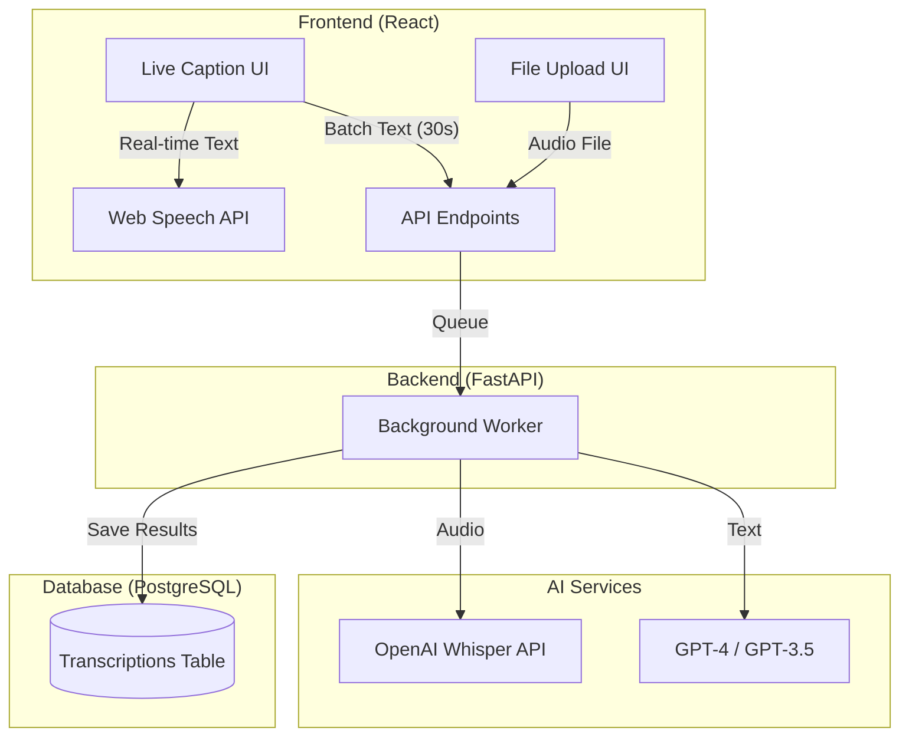

# ACCESS.AI - Transcription Module Architecture

## 1. Executive Summary
The **Transcription Module** is designed to break down communication barriers for users with hearing or cognitive impairments. It provides two core modes:
1.  **Live Intelligence**: Real-time captioning and analysis for ongoing meetings.
2.  **Deep Analysis**: Post-processing of uploaded audio files for detailed insights.

This architecture prioritizes **WCAG 2.2 Compliance**, utilizing **Generative AI** for cognitive aids (summaries, action items) and **State-of-the-Art STT** (Speech-to-Text) for accuracy.

---

## 2. Workflows

### 2.1. Live Captioning & Intelligence
For live meetings, latency is critical. We use a hybrid approach:

1.  **Instant Captions (Frontend)**:
    *   Utilize the **Web Speech API** in the browser for zero-latency captioning.
    *   **Benefit**: Instant feedback for deaf/hard-of-hearing users without network lag.
2.  **Async AI Analysis (Backend)**:
    *   Every 30 seconds, the frontend sends the accumulated text buffer to the backend.
    *   **AI Worker**: Processes the chunk to extract *real-time insights* (e.g., "Action Item detected: John to email report").
    *   **Feedback**: The UI updates the "Live Insights" sidebar without interrupting the stream.

### 2.2. Static File Upload & Deep Analysis
For past recordings (MP3/WAV/MP4):

1.  **Upload**: User uploads file via `TranscribePage`.
2.  **Processing Pipeline (FastAPI Background Task)**:
    *   **Step A (Transcribe)**: File is sent to **OpenAI Whisper (v3)** for high-accuracy, diarized transcription.
    *   **Step B (Diarize)**: Identify distinct speakers (Speaker A, Speaker B).
    *   **Step C (Analyze)**: Transcript is fed into **GPT-4**.
        *   *Prompt*: "Analyze this meeting transcript. specificy speakers. Extract 'Action Items', 'Key Concepts', and 'Sentiment'."
    *   **Step D (Save)**: Results stored in `transcriptions` table.
3.  **Notification**: Frontend polls or receives a WebSocket message when ready.

---

## 3. System Architecture

---

## 4. Database Schema & Metadata

To support searchability and context, we enhance the `Transcription` model:

### 4.1. Table: `transcriptions`
| Column | Type | Purpose |
| :--- | :--- | :--- |
| `id` | UUID | Unique Identifier |
| `user_id` | UUID | Owner |
| `audio_url` | String | Path to stored audio file (S3/Local) |
| `full_text` | Text | Complete raw transcript for search |
| `segments` | JSONB | Detailed array: `[{start: 0.5, end: 2.0, speaker: "A", text: "Hello"}]` |
| `summary` | Text | AI-generated executive summary |
| `action_items` | JSONB | List: `[{assignee: "John", task: "Email report", status: "pending"}]` |
| `key_concepts` | JSONB | List of topics discussed (for tagging) |
| `sentiment_score` | Float | -1.0 (Negative) to 1.0 (Positive) |
| `processed` | Boolean | Status flag |

### 4.2. Search Optimization (pgvector)
We will generate a **Vector Embedding** for the `summary` and `key_concepts`.
*   **Benefit**: Users can ask "What meeting discussed the Q1 Audit?" and Semantic Search will find this transcription, even if the exact keyword "Q1 Audit" wasn't in the title.

---

## 5. AI Integration Strategy

### 5.1. Speaker Diarization (Who said what?)
*   **Tool**: OpenAI Whisper supports basic diarization. For advanced needs, we can use **Pyannote.audio** (Python library).
*   **Implementation**: The backend logic will parse the Whisper response to group consecutive segments by the same speaker.

### 5.2. Cognitive Accessibility (Simplification)
For users with cognitive impairments (ADHD, Dyslexia):
*   **Auto-Summarization**: GPT-4 compresses 1 hour of talk into 5 bullet points.
*   **Sentiment Coloring**: Code text segments with colors (Red = Urgent/Angry, Green = Positive).
    *   *Implementation*: AI analyzes the tone of each paragraph and assigns a sentiment tag.

### 5.3. Real-Time "Sign Language" (Avatar)
*   **Concept**: We map the incoming text stream to a database of Sign Language video clips or using a WebGL Avatar.
*   **MVP**: Display a "Sign Language Interpreter" video overlay that loops generic signing gestures when audio is detected (as a placeholder), or integrae a specialized API like **SignAll** if available.

---

## 6. Accessibility Features Checklist

| Feature | Target Audience | Implementation |
| :--- | :--- | :--- |
| **Live Captions** | Deaf / Hard of Hearing | Web Speech API (Zero Latency) |
| **Speaker ID** | Cognitive / Memory | Color-coded names (Speaker A = Blue) |
| **Dyslexia Mode** | Dyslexia | Toggle to specific font (OpenDyslexic) & increased line spacing |
| **Summary & Actions** | ADHD / Cognitive Load | Auto-extracted "To-Do" list prevents information overload |
| **Keyboard Nav** | Motor Impairment | Full tab-index support for media player controls |
